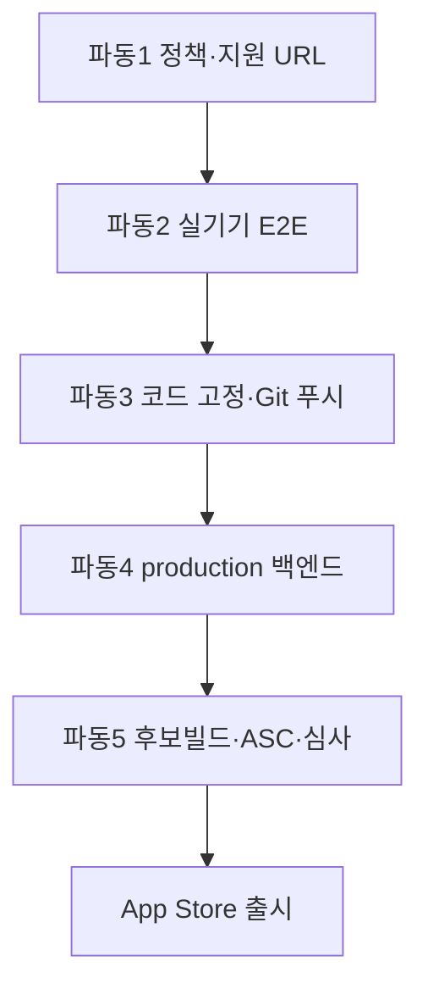

# VoiceRoom iOS 출시 실행 계획

> 작성일: 2026-07-30  
> 기준 상태: TestFlight Build 4(staging) 업로드 완료 · App Store 정식 심사 미제출  
> 작업 코드 위치: Codex `VoiceRoom 출시 진두지휘` → `voiceroom-integration`  
> 브랜치: `release/integration-local-2026-07-25`  
> 개발일지: `DEVLOG.md` (동일 워크스페이스)

이 문서는 **출시까지 남은 작업을 순서대로 실행하기 위한 단일 기준 문서**다.  
체크리스트가 아니라 **선행조건 → 실행 → 완료 기준 → 중단 조건**을 포함한 게이트 기반 계획이다.

---

## 0. 핵심 원칙 (절대 규칙)

1. **Build 4는 심사용이 아니다.** staging Supabase·RevenueCat 검증용이다.
2. **production에 배포하기 전에** 실기기 통화·Sandbox 결제 E2E를 통과해야 한다.
3. **운영 백엔드 전환과 심사용 빌드는 분리**한다. staging에서 검증한 뒤 production을 붙인 **새 후보 빌드**로만 심사 제출한다.
4. **로컬 미커밋 변경은 빌드·서버에 반영되지 않은 것**으로 취급한다.
5. 확인된 사실과 재확인이 필요한 항목을 섞지 않는다. 아래 `[확인됨]` / `[재확인]` / `[미완료]` 표기를 따른다.

---

## 1. 현재 상태 스냅샷 (2026-07-30 기준)

### 1.1 확인됨

| 항목 | 상태 |
|------|------|
| 클라이언트 자동 테스트 | 129/129 통과 |
| TypeScript · iOS 빌드 검사 | 통과 |
| Supabase 격리 DB 마이그레이션 · pgTAP | 통과 |
| RevenueCat webhook 인증 검증 | 통과 |
| TestFlight Build 4 업로드 | 성공 |
| staging Supabase · RevenueCat webhook | 온라인 배포·연결됨 |
| App Store 정식 심사 제출 | **안 함** |
| production Supabase 변경 | **안 함** |
| 심사 승인/거절 통지 | **없음** |

### 1.2 미완료 · 재확인

| 항목 | 상태 | 비고 |
|------|------|------|
| 아이폰 2대 실기기 음성 통화 | `[미완료]` | DEVLOG 기록 없음. 민호님이 이미 했다면 결과 기록 필요 |
| Sandbox 결제 → 포인트 → 필터 차감 E2E | `[미완료]` | |
| 백그라운드 복귀 · 신고/차단 · 계정 삭제 실기기 | `[미완료]` | |
| 개인정보처리방침 · 이용약관 · 지원 페이지 HTTPS | `[미완료]` | 공개 배포 작업 중이었다는 기록 |
| Apple 유료 앱 계약 · 은행/세금 정보 | `[재확인]` | 일부 미완료로 기록됨 → ASC에서 Active 여부 재확인 |
| IAP 상품 Ready to Submit | `[재확인]` | 제출 준비 중 |
| 로컬 미반영 변경사항 커밋 · GitHub 푸시 | `[미완료]` | |
| 심사용 production 빌드 | `[미완료]` | Build 4와 별개 |

### 1.3 작업처

| 구분 | 경로 / 이름 |
|------|-------------|
| 실제 출시 개발 | Codex 작업 **VoiceRoom 출시 진두지휘** |
| 코드 | `.../work/voiceroom-integration` |
| 원본 저장소 | `C:\Users\Admin\projects\voiceroom` (직접 작업처 아님) |
| 이 문서 위치 | `vegi-wang` 저장소 `voiceroom-launch/` (계획·추적 문서) |

---

## 2. 출시 게이트 한눈에 보기



| 파동 | 목표 | 다음 파동 진입 조건 |
|------|------|---------------------|
| **1. 정책·지원** | 공개 HTTPS URL 3종 확보 | Privacy / Terms / Support URL이 브라우저에서 200 응답 |
| **2. 실기기 E2E** | Build 4로 통화·결제 검증 | 통화·결제·안전 기능 체크리스트 전부 Pass |
| **3. 코드 고정** | 검증된 코드 커밋·푸시 | CI/로컬 테스트 통과 + 태그 또는 릴리스 브랜치 고정 |
| **4. production 전환** | DB·Edge·RevenueCat 운영 연결 | staging과 동일 마이그레이션·함수 적용 + smoke 통과 |
| **5. 심사 제출** | 후보 빌드 + ASC 메타 + Submit | Paid Apps Active, IAP Ready, 데모계정, Review Notes 완비 |

---

## 3. 5개 작업 파동 · 17개 실행 단계

각 단계 형식:

- **담당**: Owner / 보조
- **선행**: 이 단계 시작 전 반드시 충족
- **완료 기준**: 객관적으로 통과 판정 가능한 조건
- **중단 조건**: 발견 시 즉시 멈추고 상위 게이트로 복귀

---

### 파동 1 — 정책·지원 공개 (심사 메타 선행)

#### Step 1. 정책 문서 최종본 확정

- **담당**: 민호 / AI 보조 초안
- **선행**: 없음
- **할 일**:
  - 개인정보처리방침: 수집 항목, 수집 방법, 이용 목적, 보관·삭제, 동의 철회, 제3자(Supabase, RevenueCat, Apple, 음성 인프라) 명시
  - 이용약관: 만 18세+, UGC·신고·차단, 포인트·필터 소모, 환불(Apple IAP 기준)
  - 지원 페이지: 연락 수단(이메일 필수), FAQ 최소 3문항
- **완료 기준**: 한국어 최종본 문구 freeze. 법무 검토가 필요하면 그 전까지 “초안” 표기 유지
- **중단 조건**: 계정 삭제·데이터 삭제 경로가 문서와 앱 동작이 불일치

#### Step 2. HTTPS 공개 배포

- **담당**: 민호 / AI
- **선행**: Step 1 최종본
- **할 일**: Vercel/정적 호스팅 등으로 `/privacy`, `/terms`, `/support` 공개
- **완료 기준**:
  - 세 URL 모두 `https://` 이고 로그인 없이 열림
  - 모바일 Safari에서 레이아웃 깨짐 없음
  - App Store Connect Privacy Policy URL / Support URL에 넣을 수 있는 최종 주소 확정
- **중단 조건**: HTTP only, 비밀번호 보호, placeholder 문구 잔존
- **Apple 근거**: Privacy Policy URL은 모든 앱 필수. Support URL에 연락 수단 필요. ([App Store Connect Help](https://developer.apple.com/help/app-store-connect/manage-app-information/manage-app-privacy/), [App Review Guidelines 5.1.1](https://developer.apple.com/app-store/review/guidelines/))

#### Step 3. 앱 내 정책 링크 노출 확인

- **담당**: AI (코드) / 민호 (실기기)
- **선행**: Step 2
- **할 일**: 설정/프로필 등에서 Privacy·Terms 접근 경로 확인. 없으면 추가 후 Build 후보에 포함
- **완료 기준**: 로그인 사용자·비로그인(해당 시) 모두 2탭 이내 접근
- **중단 조건**: 앱 내 링크가 없거나 dead link

---

### 파동 2 — Build 4 실기기 E2E (staging)

> Build 4만 사용. production env를 붙이지 않는다.

#### Step 4. TestFlight 설치·계정 준비

- **담당**: 민호
- **선행**: ASC에서 Build 4가 Team(Expo) 그룹에 배포됨
- **할 일**:
  - 아이폰 2대에 TestFlight → VoiceRoom 1.0.0 (Build 4) 설치
  - 보이스룸 계정 A/B 2개 (만 18세+)
  - 마이크 권한 허용
- **완료 기준**: 두 기기에서 각각 다른 계정으로 로그인 성공
- **중단 조건**: Build 4가 테스터에게 안 보이면 ASC에서 그룹·테스터 재배정 후 재시도

#### Step 5. 게시·채팅·통화 E2E

- **담당**: 민호
- **선행**: Step 4
- **체크리스트**:

| # | 시나리오 | Pass |
|---|----------|------|
| 5.1 | A가 게시글 작성, B가 검색/피드에서 발견 | ☐ |
| 5.2 | B 대화 요청 → A 수락 → 동일 채팅방 | ☐ |
| 5.3 | 양쪽 메시지 1회 이상 송수신 | ☐ |
| 5.4 | B 통화 초대 → A 수락 | ☐ |
| 5.5 | 양방향 음성 (서로 다른 문장) | ☐ |
| 5.6 | 스피커 on/off, 음소거, 정상 종료 | ☐ |
| 5.7 | 통화 중 10초 백그라운드 후 복귀 유지 | ☐ |
| 5.8 | 한쪽 Wi-Fi 끊김·복구 시 재연결 또는 graceful fail | ☐ |
| 5.9 | 한쪽 종료 시 양쪽 종료 상태 일치 | ☐ |
| 5.10 | 차단 후 상대 통화 초대 불가 | ☐ |
| 5.11 | 충돌/강제종료 없음 | ☐ |

- **완료 기준**: 5.1–5.11 전부 Pass + DEVLOG에 기기 모델·iOS·시각·결과 기록
- **중단 조건**: 음성 단방향/무음, 수락 후 연결 실패, 크래시 → 버그 티켓화 후 코드 수정·재빌드 (파동 3으로 우회하지 말 것)
- **팁**: 기기 나란히 두면 하울링 → 다른 방 또는 이어폰

#### Step 6. Sandbox/TestFlight 결제 → 포인트 → 필터

- **담당**: 민호
- **선행**: Step 5 Pass, IAP 상품이 ASC에서 조회 가능 (`Ready to Submit` 또는 동등)
- **할 일**:
  - TestFlight 내 구매(샌드박스 백엔드, 실결제 없음)
  - RevenueCat webhook → 포인트 적립 확인
  - 필터 사용 시 포인트 차감 확인
  - 잔액 불일치/중복 적립 없는지 확인
- **완료 기준**: 구매 1회 + 적립 + 차감이 staging DB·앱 UI에서 일치
- **중단 조건**: webhook 미수신, 중복 적립, Missing Metadata로 상품 미노출
- **참고**: TestFlight 구매는 테스터 Apple ID 사용. Xcode 직접 설치 시에만 Sandbox Apple Account 슬롯이 필요할 수 있음.

#### Step 7. 안전·계정 실기기

- **담당**: 민호
- **선행**: Step 5
- **체크리스트**: 신고 제출, 차단, 계정 삭제(또는 삭제 요청) 후 재로그인 불가/데이터 처리 기대와 일치
- **완료 기준**: 3항목 Pass + DEVLOG 기록
- **중단 조건**: 계정 삭제가 정책 문구와 불일치 → Step 1로 복귀

**파동 2 게이트 승인**: Step 5–7 Pass 서명(날짜·담당) 후 파동 3 진입.

---

### 파동 3 — 코드 고정 · 원격 반영

#### Step 8. 로컬 변경사항 정리·테스트

- **담당**: AI / 민호
- **선행**: 파동 2 게이트
- **할 일**: 미커밋 변경 리뷰, 회귀 테스트(클라이언트 129 + 관련 백엔드) 재실행
- **완료 기준**: 테스트 전부 + 변경 범위가 DEVLOG에 한 줄 요약됨
- **중단 조건**: 회귀 실패

#### Step 9. Git 커밋 · GitHub 푸시

- **담당**: 민호 (원 저장소 권한) / AI (Codex 워크스페이스)
- **선행**: Step 8
- **할 일**: `release/...` 또는 main 대상 PR, 원격 푸시, 릴리스 후보 커밋 SHA 기록
- **완료 기준**: 원격에 동일 SHA 존재, CI  greent(있는 경우)
- **중단 조건**: 시크릿·`.env` 커밋 감지

#### Step 10. 출시 후보 태그

- **담당**: 민호
- **선행**: Step 9
- **할 일**: `v1.0.0-rc.1` 등 태그. Build 4 SHA와 다르면 DEVLOG에 차이 명시
- **완료 기준**: 태그가 원격에 push됨
- **중단 조건**: 태그 대상이 미검증 커밋

---

### 파동 4 — production 백엔드 전환

> staging에서 검증된 마이그레이션·Edge Function만 적용. 실험적 변경 금지.

#### Step 11. production Supabase 마이그레이션

- **담당**: 민호 (승인) / AI (실행 스크립트)
- **선행**: Step 10, 백업/롤백 계획 문서화
- **할 일**: 검증된 migration 적용, RLS·권한 확인, pgTAP 또는 smoke SQL
- **완료 기준**: migration 성공 로그 + smoke Pass
- **중단 조건**: migration 실패·데이터 손상 징후 → 즉시 롤백

#### Step 12. Edge Functions · RevenueCat production webhook

- **담당**: AI / 민호
- **선행**: Step 11
- **할 일**:
  - Edge Functions production 배포
  - RevenueCat production/앱 웹훅 URL·시크릿 설정
  - 환경 변수(프로덕션 키) 점검 — staging 키 잔존 금지
- **완료 기준**: 테스트 이벤트 1건이 production에서 정상 처리
- **중단 조건**: staging 키로 production 앱이 붙는 구성

#### Step 13. production smoke (서버)

- **담당**: AI / 민호
- **선행**: Step 12
- **할 일**: 가입/로그인 API, 게시·채팅 REST/Realtime, 통화 토큰 발급, 잔액 조회 smoke
- **완료 기준**: smoke 스크립트 또는 수동 체크리스트 Pass
- **중단 조건**: 5xx 지속, Realtime 연결 실패

**파동 4 게이트 승인**: production smoke Pass 후 파동 5.

---

### 파동 5 — 후보 빌드 · App Store Connect · 심사

#### Step 14. Apple 계약·IAP·메타데이터

- **담당**: 민호
- **선행**: Step 2 URL 확정
- **할 일**:
  - Paid Applications Agreement / 은행·세금 = **Active**
  - IAP: 이름·설명·가격·심사 스크린샷 → **Ready to Submit**
  - Privacy Policy URL, Support URL 입력
  - 앱 설명·스크린샷·연령·App Privacy 설문
  - 연령 만 18+ / UGC 관련 메타 정합성
- **완료 기준**: ASC에서 제출 차단 항목 0
- **중단 조건**: 계약 Waiting, IAP Missing Metadata

#### Step 15. production 연결 후보 빌드 생성·업로드

- **담당**: AI (EAS/로컬 빌드) / 민호 (ASC)
- **선행**: 파동 4 + Step 14 진행 가능 상태
- **할 일**: production env로 iOS 빌드 → TestFlight 업로드 (Build 5+ 예상)
- **완료 기준**: 새 빌드 처리 완료, **production** 백엔드에 붙어 로그인됨
- **중단 조건**: 실수로 staging URL이 번들에 포함

#### Step 16. 후보 빌드 짧은 회귀 (실기기)

- **담당**: 민호
- **선행**: Step 15
- **할 일**: Step 5·6의 축소판 — 로그인, 통화 1회, 구매 1회, 정책 URL 인앱 오픈
- **완료 기준**: 축소 체크리스트 Pass
- **중단 조건**: production 전용 장애 → 파동 4로 복귀

#### Step 17. App Review 제출

- **담당**: 민호
- **선행**: Step 14–16
- **할 일**:
  - 데모 계정(심사자용) + 비밀번호
  - Review Notes: 통화 테스트 경로(게시→요청→수락→통화), IAP 경로, 마이크 권한 안내, 18+ 안내
  - IAP를 버전 제출에 포함
  - Submit for Review
- **완료 기준**: 상태가 Waiting for Review / In Review
- **중단 조건**: 제출 전 체크리스트 미충족 항목 발견

---

## 4. 역할 분담

| 역할 | 담당 | 범위 |
|------|------|------|
| 제품 오너 · ASC · 실기기 | 민호 | 계약, 메타, TestFlight, E2E 서명, 심사 제출 |
| 구현 · 배포 스크립트 · 문서 | AI (Codex/Cursor) | 코드, 정책 페이지, 마이그레이션 실행 보조, 본 계획 갱신 |
| 기록 | 공동 | 모든 Pass/Fail을 `DEVLOG.md`에 날짜와 함께 남김 |

---

## 5. 중단·롤백 정책

| 상황 | 조치 |
|------|------|
| 실기기 통화 실패 | 심사·production 금지. 버그픽스 → 새 TestFlight → Step 5 재실행 |
| 결제/포인트 불일치 | webhook·idempotency 점검. 파동 4 진입 금지 |
| production migration 실패 | 즉시 롤백. 출시 일정 재설정 |
| 심사 거절 | 거절 사유를 DEVLOG에 붙이고 해당 Step만 재오픈 |
| 시크릿 유출 | 키 로테이션 후 배포 재개 |

---

## 6. 일일 스탠딩용 한 줄 현황판

복사해서 DEVLOG 상단에 갱신:

```
날짜:
파동: 1 / 2 / 3 / 4 / 5
현재 Step:
차단 이슈:
다음 액션(담당):
후보 빌드:
ASC 상태: (미제출 / Waiting / In Review / Rejected / Ready for Sale)
```

---

## 7. Review Notes 초안 (Step 17용)

```text
VoiceRoom is an 18+ voice chat app.

Demo account:
- Email: [REVIEW_EMAIL]
- Password: [REVIEW_PASSWORD]

How to test a call (two accounts recommended; one account can still verify UI):
1. Sign in with the demo account.
2. Open a post / create a post.
3. Send or accept a conversation request.
4. In the chat room, send a call invite and accept.
5. Grant microphone permission when prompted.

In-App Purchase:
- Open Points / Store screen.
- Purchase a consumable points pack (sandbox; no charge).
- Points balance should increase; using a filter should decrease points.

Age: Users must be 18+.
Moderation: Report and block are available from profile/chat menus.
Privacy / Terms / Support: Linked in Settings and in App Store metadata.
```

---

## 8. 실기기 통화 테스트 빠른 가이드 (Step 5 요약)

1. 아이폰 2대 + TestFlight Build 4  
2. 계정 A/B로 각각 로그인  
3. A 게시 → B 요청 → A 수락 → 채팅  
4. 통화 초대·수락 → 양방향 음성  
5. 스피커/음소거/종료/백그라운드/차단 확인  
6. 결과를 DEVLOG에 기록  

---

## 9. 이 문서로 하지 않는 것

- production 즉시 배포 (파동 2 전 금지)
- Build 4를 그대로 심사 제출 (staging 빌드)
- 자동화 테스트만으로 실기기 E2E 대체
- 원본 `projects/voiceroom`에 직접 출시 작업 (통합 워크스페이스 사용)

---

## 10. 다음 즉시 액션 (지금 할 일)

우선순위 고정:

1. **[민호]** Step 4–5: Build 4로 아이폰 2대 통화 테스트 + DEVLOG 기록  
2. **[민호]** Step 6: Sandbox 결제·포인트·필터  
3. **[민호]** Step 2: `voiceroom-launch/policy-site` 를 Vercel에 배포하고 문의 메일 실주소로 교체  
4. **[민호]** ASC에서 Paid Apps · IAP 상태 재확인 (Step 14 선행 점검)  
5. 위가 끝나면 Step 8부터 코드 고정 → production → 후보 빌드 → 심사  

### 이번 Cursor 세션에서 완료한 것

- [x] 본 실행 계획 문서 작성 (5파동 · 17단계)
- [x] 정책·약관·지원 정적 사이트 초안 (`policy-site/`)
- [ ] 정책 사이트 실제 HTTPS 배포 (Vercel 인증 필요 — 민호 배포)
- [ ] 실기기 E2E (민호)
- [ ] production 전환 · 심사용 빌드 (실기기 Pass 후)

---

## 변경 이력

| 날짜 | 내용 |
|------|------|
| 2026-07-30 | 초안: 5파동 · 17단계 · 게이트/중단조건. Codex 대화·DEVLOG 주장 및 Apple 공개 요구사항 반영 |
| 2026-07-30 | `policy-site` 초안 추가. Step 1 문구 초안·Step 2 배포 대기 상태로 갱신 |
